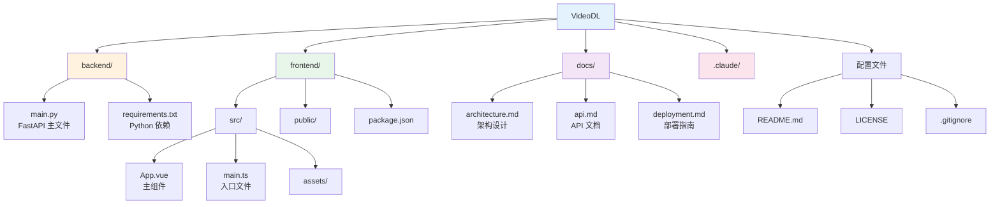

# VideoDL - 万能视频下载器

<div align="center">


一个功能强大、支持 1000+ 网站的视频下载工具，基于 yt-dlp 构建，采用 Vue3 + Vite + Tailwind CSS + FastAPI 技术栈。

[功能特性](#-功能特性) • [快速开始](#-快速开始) • [使用说明](#-使用说明) • [API 文档](#-api-文档) • [贡献指南](#-贡献指南)

</div>

## ✨ 功能特性

### 核心功能
- 🎬 **支持 1000+ 平台**：YouTube、Bilibili、抖音、快手、Twitter、Instagram、TikTok 等主流视频网站
- 🚀 **极速下载**：多线程加速，支持高清晰度视频下载
- 🎵 **无水印保存**：原画质量，高清保存，无水印
- 📊 **实时进度**：显示下载进度、速度和文件大小
- 🔄 **自动重试**：网络不稳定时自动重试，确保下载成功
- 📝 **智能文件名**：自动清理文件名，移除话题标签和特殊字符

### 技术特性
- 💻 **现代化 UI**：采用 Vue3 + Tailwind CSS 构建的美观界面
- 🔒 **安全可靠**：无需登录，直接使用，保护用户隐私
- 🌐 **跨平台支持**：支持 Windows、macOS、Linux
- 📦 **一键下载**：简单易用，粘贴链接即可下载
- 🎨 **响应式设计**：完美适配桌面和移动设备

### 抖音专属功能
- 🎯 **无需 Cookie**：使用移动端 API，无需用户提供 Cookie
- 🖼️ **图集支持**：支持抖音图集批量下载
- 📱 **短视频优化**：针对抖音短视频进行优化

## 🛠️ 技术栈

### 前端
- **框架**: Vue 3 (Composition API)
- **构建工具**: Vite
- **样式**: Tailwind CSS
- **UI 组件**: Ant Design Vue
- **语言**: TypeScript
- **图标**: Ant Design Icons

### 后端
- **框架**: FastAPI
- **视频下载**: yt-dlp
- **语言**: Python 3.8+
- **异步处理**: asyncio + ThreadPoolExecutor
- **CORS**: 支持跨域请求

### 核心依赖
- **yt-dlp**: 视频下载引擎
- **requests**: HTTP 请求库
- **python-multipart**: 文件上传支持

## 📦 快速开始

### 环境要求

- **Node.js**: 18.0.0 或更高版本
- **Python**: 3.8 或更高版本
- **FFmpeg**: 用于视频合并（可选，某些格式需要）

### 安装步骤

#### 1. 克隆项目

```bash
git clone https://github.com/Alanjinchenzhu/universal-video-downloader.git
cd universal-video-downloader
```

#### 2. 安装后端依赖

```bash
cd backend
pip install -r requirements.txt
```

#### 3. 安装前端依赖

```bash
cd frontend
npm install
```

### 运行项目

#### 方式一：开发模式

**启动后端服务**（终端 1）：

```bash
cd backend
python main.py
```

后端服务将运行在 http://localhost:8000

**启动前端开发服务器**（终端 2）：

```bash
cd frontend
npm run dev
```

前端将运行在 http://localhost:5173

#### 方式二：生产部署

**构建前端**：

```bash
cd frontend
npm run build
```

**使用 Nginx 部署**：

```nginx
server {
    listen 80;
    server_name your-domain.com;

    # 前端静态文件
    location / {
        root /path/to/frontend/dist;
        try_files $uri $uri/ /index.html;
    }

    # 后端 API
    location /api {
        proxy_pass http://localhost:8000;
        proxy_set_header Host $host;
        proxy_set_header X-Real-IP $remote_addr;
    }
}
```

**启动后端服务**：

```bash
cd backend
uvicorn main:app --host 0.0.0.0 --port 8000 --workers 4
```

## 📖 使用说明

### Web 界面使用

1. **打开浏览器**
   - 访问 http://localhost:5173

2. **粘贴视频链接**
   - 在输入框中粘贴视频页面链接
   - 支持格式：
     - `https://www.youtube.com/watch?v=xxx`
     - `https://www.bilibili.com/video/BVxxx`
     - `https://www.douyin.com/video/xxx`
     - 以及其他支持平台的链接

3. **查看视频信息**
   - 系统自动识别平台并获取视频信息
   - 显示视频标题、时长、缩略图等

4. **开始下载**
   - 点击"开始下载"按钮
   - 实时查看下载进度、速度和文件大小
   - 下载完成后自动保存到本地

### API 使用

#### 获取视频信息

```bash
curl -X POST http://localhost:8000/info \
  -H "Content-Type: application/json" \
  -d '{"url": "https://www.youtube.com/watch?v=dQw4w9WgXcQ"}'
```

#### 下载视频

```bash
curl -X POST http://localhost:8000/download \
  -H "Content-Type: application/json" \
  -d '{"url": "https://www.youtube.com/watch?v=dQw4w9WgXcQ"}' \
  --output video.mp4
```

详细的 API 文档请参考 [docs/api.md](docs/api.md)

## 🌐 支持的平台

### 视频平台
- ✅ **YouTube** - 视频、播放列表、直播回放
- ✅ **Bilibili** - 视频、番剧、课程
- ✅ **抖音** - 短视频、直播、图集（无需 Cookie）
- ✅ **快手** - 短视频、直播回放
- ✅ **Twitter/X** - 视频、GIF、图片
- ✅ **Instagram** - 视频、Reels、Stories
- ✅ **TikTok** - 国际版短视频
- ✅ **微博** - 视频、直播、图片
- ✅ **小红书** - 视频、图文笔记
- ✅ **优酷** - 电视剧、电影、综艺
- ✅ **腾讯视频** - 会员视频、综艺、动漫

### 其他平台
- 以及 1000+ 其他视频网站，详见 [yt-dlp 支持列表](https://github.com/yt-dlp/yt-dlp/blob/master/supportedsites.md)

## 📁 项目结构



**目录说明**:

| 目录 | 说明 |
|------|------|
| `backend/` | FastAPI 后端代码 |
| `frontend/` | Vue3 前端代码 |
| `docs/` | 项目文档 |
| `.claude/` | Claude 技能配置 |

## 🔧 配置说明

### 后端配置

在 `backend/main.py` 中可以配置：

```python
# CORS 配置
app.add_middleware(
    CORSMiddleware,
    allow_origins=["*"],  # 生产环境请修改为具体域名
    allow_credentials=True,
    allow_methods=["*"],
    allow_headers=["*"],
)

# 线程池配置
executor = ThreadPoolExecutor(max_workers=4)
```

### 前端配置

在 `frontend/src/App.vue` 中可以配置：

```typescript
// API 基础地址
const API_BASE = 'http://localhost:8000'  // 生产环境请修改为实际地址
```

## 🚀 性能优化

### 后端优化
- **并发下载**: 4 个并发连接
- **缓冲区大小**: 16KB
- **自动重试**: 最多 3 次重试
- **流式传输**: 避免内存溢出

### 前端优化
- **数据流处理**: 使用 ReadableStream 处理大文件
- **防抖处理**: 避免频繁请求
- **懒加载**: 图片按需加载

## 📚 文档

- [架构设计文档](docs/architecture.md) - 系统架构和设计说明
- [API 文档](docs/api.md) - 完整的 API 接口文档
- [部署文档](docs/deployment.md) - 生产环境部署指南

## 🤝 贡献指南

欢迎贡献代码、报告问题或提出建议！

### 贡献流程

1. Fork 本仓库
2. 创建特性分支 (`git checkout -b feature/AmazingFeature`)
3. 提交更改 (`git commit -m 'Add some AmazingFeature'`)
4. 推送到分支 (`git push origin feature/AmazingFeature`)
5. 提交 Pull Request

### 代码规范

- **Python**: 遵循 PEP 8 规范
- **TypeScript**: 遵循 ESLint 规范
- **提交信息**: 使用 Conventional Commits 规范

## 🐛 问题反馈

如果您遇到任何问题或有任何建议，请：

1. 查看 [Issues](https://github.com/Alanjinchenzhu/universal-video-downloader/issues) 确认是否已有人提出
2. 如果没有，请创建新的 Issue，包含：
   - 问题描述
   - 复现步骤
   - 预期行为
   - 实际行为
   - 环境信息（操作系统、Python 版本等）

## 📜 许可证

本项目基于 [MIT License](LICENSE) 开源。

## ⚠️ 免责声明

本工具仅供学习和个人使用，请勿用于商业用途。下载视频时请遵守相关网站的服务条款和法律法规。

## 🙏 致谢

- [yt-dlp](https://github.com/yt-dlp/yt-dlp) - 强大的视频下载工具
- [FastAPI](https://fastapi.tiangolo.com/) - 现代化的 Python Web 框架
- [Vue.js](https://vuejs.org/) - 渐进式 JavaScript 框架
- [Tailwind CSS](https://tailwindcss.com/) - 实用优先的 CSS 框架
- [Ant Design Vue](https://www.antdv.com/) - 企业级 UI 组件库

## 📮 联系方式

- **GitHub**: https://github.com/Alanjinchenzhu/universal-video-downloader
- **Gitee**: https://gitee.com/z-jinchen/universal-video-downloader

---

<div align="center">

**如果这个项目对您有帮助，请给一个 ⭐️ Star！**

Made with ❤️ by VideoDL Team

</div>
