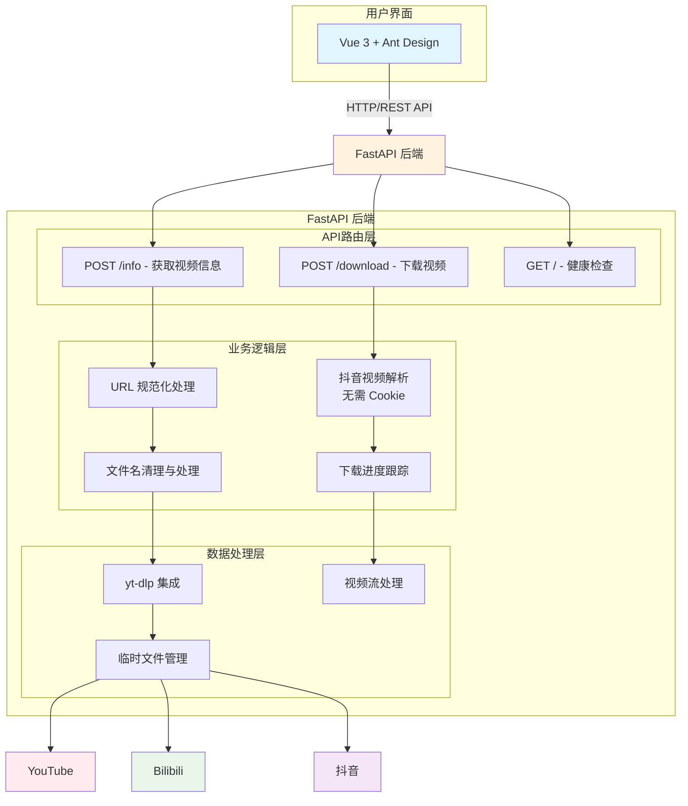
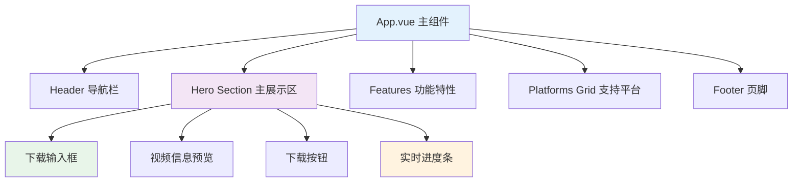
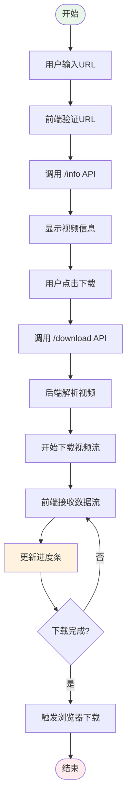
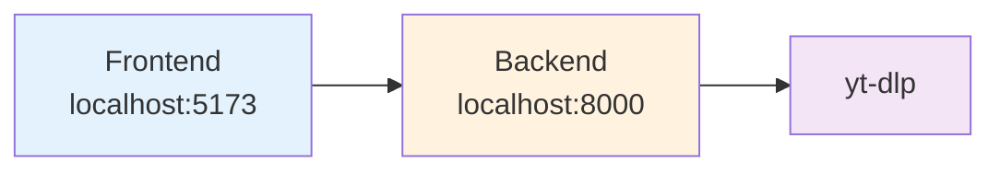
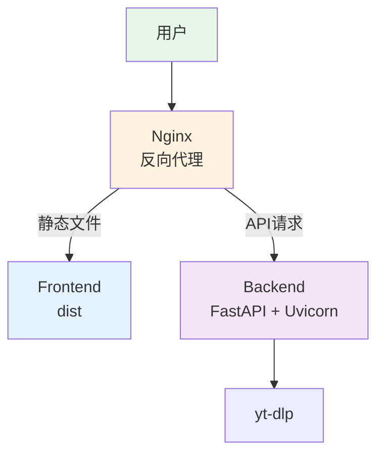

# VideoDL 架构设计文档

## 1. 系统概述

VideoDL 是一个基于 FastAPI + Vue3 的万能视频下载器，支持 1000+ 视频网站的高清视频下载。

### 1.1 技术栈

- **后端**: FastAPI + yt-dlp + Python 3.12
- **前端**: Vue 3 + Vite + Ant Design Vue + Tailwind CSS
- **核心引擎**: yt-dlp (YouTube-DL 的增强版)

### 1.2 系统架构



## 2. 核心模块设计

### 2.1 后端模块

#### 2.1.1 API 路由模块

**文件**: `backend/main.py`

**主要端点**:

1. **GET /** - 健康检查
   - 返回服务状态
   - 验证后端是否正常运行

2. **POST /info** - 获取视频信息
   - 输入: 视频URL
   - 输出: 视频元数据（标题、时长、缩略图、格式等）
   - 支持平台: YouTube, Bilibili, 抖音等

3. **POST /download** - 下载视频
   - 输入: 视频URL、格式选择、是否仅音频
   - 输出: 视频文件流
   - 特性: 实时进度、断点续传、文件名清理

#### 2.1.2 视频解析模块

**抖音视频解析**:
- 使用移动端 API，无需 Cookie
- 自动提取视频 ID
- 解析视频信息（标题、作者、封面、视频URL）
- 支持图集下载

**通用视频解析**:
- 基于 yt-dlp 引擎
- 自动识别视频平台
- 提取多种格式信息
- 支持字幕和弹幕下载

#### 2.1.3 下载优化模块

**并发下载**:
- 片段并发下载: 4 个并发连接
- 缓冲区大小: 16KB
- 自动重试机制

**文件处理**:
- 文件名清理: 移除话题标签和特殊字符
- 临时文件管理: 自动清理
- 流式传输: 支持大文件下载

### 2.2 前端模块

#### 2.2.1 组件结构



#### 2.2.2 状态管理

**下载状态**:
- `isDownloading`: 是否正在下载
- `downloadProgress`: 下载进度 (0-100%)
- `downloadSpeed`: 下载速度
- `downloadSize`: 已下载大小
- `totalSize`: 总大小
- `downloadStatus`: 下载状态

**视频信息**:
- `videoInfo`: 视频元数据
- `videoUrl`: 视频URL

#### 2.2.3 UI/UX 设计

**设计原则**:
- 现代化渐变背景
- 流畅的动画效果
- 响应式布局
- 清晰的视觉层次

**配色方案**:
- 主色调: #0EA5E9 (天蓝色)
- 辅助色: #0D9488 (青绿色)
- 强调色: #F97316 (橙色)
- 背景色: #F0F9FF (浅蓝色)

## 3. 数据流设计

### 3.1 下载流程



### 3.2 数据格式

#### 3.2.1 视频信息响应

```json
{
  "title": "视频标题",
  "description": "视频描述",
  "duration": 180,
  "thumbnail": "https://...",
  "uploader": "上传者",
  "view_count": 1000000,
  "like_count": 50000,
  "formats": [
    {
      "format_id": "best",
      "ext": "mp4",
      "resolution": "1920x1080",
      "filesize": 102400000,
      "vcodec": "h264",
      "acodec": "aac"
    }
  ]
}
```

#### 3.2.2 下载请求

```json
{
  "url": "https://www.youtube.com/watch?v=xxx",
  "format": "best",
  "audio_only": false
}
```

## 4. 性能优化

### 4.1 后端优化

1. **并发下载**
   - 使用线程池处理并发请求
   - 片段并发下载提高速度
   - 异步 I/O 减少阻塞

2. **缓存策略**
   - 视频信息缓存
   - 减少重复解析

3. **内存管理**
   - 流式传输避免内存溢出
   - 及时清理临时文件

### 4.2 前端优化

1. **数据流处理**
   - 使用 ReadableStream 处理大文件
   - 分块下载避免内存问题

2. **UI 优化**
   - 虚拟滚动处理大量数据
   - 懒加载图片
   - 防抖处理用户输入

3. **网络优化**
   - 请求合并
   - 错误重试机制

## 5. 安全设计

### 5.1 CORS 配置

```python
app.add_middleware(
    CORSMiddleware,
    allow_origins=["*"],
    allow_credentials=True,
    allow_methods=["*"],
    allow_headers=["*"],
    expose_headers=["Content-Disposition"],
)
```

### 5.2 输入验证

- URL 格式验证
- 文件名清理防止路径遍历
- 请求大小限制

### 5.3 错误处理

- 统一错误响应格式
- 详细的错误日志
- 友好的用户提示

## 6. 扩展性设计

### 6.1 平台扩展

新增平台支持只需:
1. 添加平台解析函数
2. 注册到路由中
3. 更新前端平台列表

### 6.2 功能扩展

- 播放列表批量下载
- 字幕提取
- 视频转码
- 云存储集成

## 7. 部署架构

### 7.1 开发环境



### 7.2 生产环境



## 8. 监控与日志

### 8.1 日志记录

- 请求日志
- 错误日志
- 性能日志
- 下载统计

### 8.2 监控指标

- 请求成功率
- 下载速度
- 错误率
- 资源使用率

## 9. 未来规划

### 9.1 短期目标

- [ ] 添加播放列表支持
- [ ] 支持更多视频格式
- [ ] 添加用户认证
- [ ] 实现下载历史记录

### 9.2 长期目标

- [ ] 分布式下载
- [ ] 视频转码服务
- [ ] 移动端应用
- [ ] 浏览器插件
