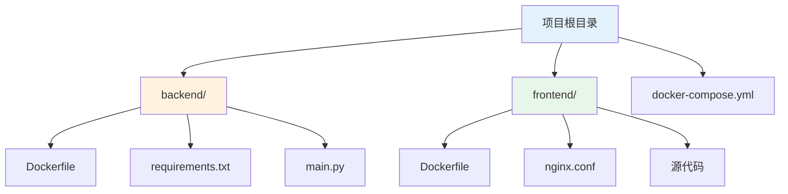

# Docker 部署运维文档

本文档详细说明如何使用 Docker 部署和运维 VideoDL 视频下载器。

## 目录

- [环境要求](#环境要求)
- [快速部署](#快速部署)
- [配置说明](#配置说明)
- [运维管理](#运维管理)
- [故障排查](#故障排查)
- [性能优化](#性能优化)

## 环境要求

### 系统要求

| 项目 | 最低要求 | 推荐配置 |
|------|----------|----------|
| 操作系统 | Windows 10/11, macOS 10.15+, Ubuntu 18.04+ | Windows 11, macOS 13+, Ubuntu 22.04+ |
| CPU | 2核 | 4核+ |
| 内存 | 4GB | 8GB+ |
| 磁盘 | 10GB | 50GB+ |

### 软件要求

| 软件 | 版本要求 | 用途 |
|------|----------|------|
| Docker Desktop | 20.0+ | 容器运行环境 |
| Docker Compose | 2.0+ | 容器编排工具 |

### 安装 Docker

#### Windows

1. 下载 [Docker Desktop for Windows](https://www.docker.com/products/docker-desktop)
2. 运行安装程序并重启电脑
3. 启动 Docker Desktop 并等待启动完成

#### macOS

```bash
# 使用 Homebrew 安装
brew install --cask docker

# 或下载 Docker Desktop for Mac
# https://www.docker.com/products/docker-desktop
```

#### Linux (Ubuntu)

```bash
# 安装 Docker
curl -fsSL https://get.docker.com -o get-docker.sh
sudo sh get-docker.sh

# 安装 Docker Compose
sudo curl -L "https://github.com/docker/compose/releases/latest/download/docker-compose-$(uname -s)-$(uname -m)" -o /usr/local/bin/docker-compose
sudo chmod +x /usr/local/bin/docker-compose

# 添加当前用户到 docker 组
sudo usermod -aG docker $USER
```

## 快速部署

### 1. 克隆项目

```bash
git clone https://github.com/Alanjinchenzhu/universal-video-downloader.git
cd universal-video-downloader
```

### 2. 一键部署

```bash
# 构建并启动所有服务
docker-compose up -d

# 查看服务状态
docker-compose ps
```

### 3. 访问应用

- **前端界面**: http://localhost
- **后端 API**: http://localhost:8000
- **API 文档**: http://localhost:8000/docs

## 配置说明

### 项目结构



### Docker Compose 配置

```yaml
# docker-compose.yml
services:
  # 后端服务
  backend:
    build:
      context: ./backend
      dockerfile: Dockerfile
    container_name: videodl-backend
    ports:
      - "8000:8000"
    environment:
      - PYTHONUNBUFFERED=1
    networks:
      - videodl-network
    restart: unless-stopped

  # 前端服务
  frontend:
    build:
      context: ./frontend
      dockerfile: Dockerfile
    container_name: videodl-frontend
    ports:
      - "80:80"
    depends_on:
      - backend
    networks:
      - videodl-network
    restart: unless-stopped

networks:
  videodl-network:
    driver: bridge
```

### 后端 Dockerfile

```dockerfile
# backend/Dockerfile
FROM python:3.12-slim

WORKDIR /app

# 使用国内镜像源加速
RUN echo 'deb http://mirrors.aliyun.com/debian/ trixie main non-free non-free-firmware' > /etc/apt/sources.list && \
    echo 'deb http://mirrors.aliyun.com/debian/ trixie-updates main non-free non-free-firmware' >> /etc/apt/sources.list

# 安装系统依赖
RUN apt-get update && apt-get install -y \
    ffmpeg \
    gcc \
    && rm -rf /var/lib/apt/lists/*

# 安装 Python 依赖
COPY requirements.txt .
RUN pip install --no-cache-dir -r requirements.txt

# 复制应用代码
COPY main.py .

EXPOSE 8000

CMD ["uvicorn", "main:app", "--host", "0.0.0.0", "--port", "8000"]
```

### 前端 Dockerfile

```dockerfile
# frontend/Dockerfile
# 构建阶段
FROM node:20-alpine AS builder

WORKDIR /app
COPY package*.json ./
RUN npm install
COPY . .
RUN npm run build

# 生产阶段
FROM nginx:alpine

COPY --from=builder /app/dist /usr/share/nginx/html
COPY nginx.conf /etc/nginx/conf.d/default.conf

EXPOSE 80

CMD ["nginx", "-g", "daemon off;"]
```

### Nginx 配置

```nginx
# frontend/nginx.conf
server {
    listen 80;
    server_name localhost;
    root /usr/share/nginx/html;
    index index.html;

    # 前端路由支持
    location / {
        try_files $uri $uri/ /index.html;
    }

    # 静态资源缓存
    location ~* \.(js|css|png|jpg|jpeg|gif|ico|svg)$ {
        expires 1y;
        add_header Cache-Control "public, immutable";
    }

    # API 代理到后端
    location /api {
        proxy_pass http://backend:8000;
        proxy_set_header Host $host;
        proxy_set_header X-Real-IP $remote_addr;
        proxy_set_header X-Forwarded-For $proxy_add_x_forwarded_for;
        proxy_set_header X-Forwarded-Proto $scheme;
    }
}
```

## 运维管理

### 服务管理

```bash
# 启动所有服务
docker-compose up -d

# 停止所有服务
docker-compose down

# 重启所有服务
docker-compose restart

# 重启单个服务
docker-compose restart backend
docker-compose restart frontend

# 查看服务状态
docker-compose ps

# 查看服务日志
docker-compose logs
docker-compose logs backend
docker-compose logs frontend

# 实时查看日志
docker-compose logs -f backend
```

### 镜像管理

```bash
# 重新构建镜像
docker-compose build

# 重新构建单个服务镜像
docker-compose build backend
docker-compose build frontend

# 不使用缓存重新构建
docker-compose build --no-cache

# 查看镜像列表
docker images | grep yt-dlp-master

# 删除旧镜像
docker image prune
```

### 容器管理

```bash
# 进入后端容器
docker exec -it videodl-backend /bin/bash

# 进入前端容器
docker exec -it videodl-frontend /bin/sh

# 查看容器资源使用
docker stats videodl-backend videodl-frontend

# 查看容器详细信息
docker inspect videodl-backend
```

### 数据管理

```bash
# 查看容器日志文件大小
docker exec videodl-backend du -sh /var/log

# 清理容器内临时文件
docker exec videodl-backend rm -rf /tmp/*

# 导出容器日志
docker logs videodl-backend > backend.log 2>&1
```

### 更新部署

```bash
# 拉取最新代码
git pull origin master

# 重新构建并启动
docker-compose down
docker-compose build --no-cache
docker-compose up -d

# 或者使用一条命令
docker-compose up -d --build
```

## 故障排查

### 常见问题

#### 1. 容器无法启动

```bash
# 查看容器日志
docker logs videodl-backend

# 查看容器状态
docker ps -a

# 检查端口占用
netstat -ano | findstr :8000
netstat -ano | findstr :80
```

#### 2. 网络连接问题

```bash
# 检查网络
docker network ls
docker network inspect yt-dlp-master_videodl-network

# 重建网络
docker-compose down
docker-compose up -d
```

#### 3. 镜像拉取失败

```bash
# 使用代理
# 在 Docker Desktop 设置中配置代理

# 或手动拉取镜像
docker pull python:3.12-slim
docker pull node:20-alpine
docker pull nginx:alpine
```

#### 4. 磁盘空间不足

```bash
# 查看磁盘使用
docker system df

# 清理未使用的资源
docker system prune -a

# 清理所有未使用的卷
docker volume prune
```

### 日志分析

```bash
# 查看最近 100 行日志
docker logs --tail 100 videodl-backend

# 查看指定时间段的日志
docker logs --since 2024-01-01T00:00:00 videodl-backend

# 搜索错误日志
docker logs videodl-backend 2>&1 | grep -i error
```

### 健康检查

```bash
# 检查后端 API
curl http://localhost:8000/

# 检查前端
curl http://localhost/

# 检查容器健康状态
docker inspect --format='{{.State.Health.Status}}' videodl-backend
```

## 性能优化

### 资源限制

在 `docker-compose.yml` 中添加资源限制：

```yaml
services:
  backend:
    # ... 其他配置
    deploy:
      resources:
        limits:
          cpus: '2'
          memory: 2G
        reservations:
          cpus: '1'
          memory: 1G

  frontend:
    # ... 其他配置
    deploy:
      resources:
        limits:
          cpus: '1'
          memory: 512M
        reservations:
          cpus: '0.5'
          memory: 256M
```

### 日志轮转

配置日志驱动和轮转策略：

```yaml
services:
  backend:
    # ... 其他配置
    logging:
      driver: "json-file"
      options:
        max-size: "10m"
        max-file: "3"

  frontend:
    # ... 其他配置
    logging:
      driver: "json-file"
      options:
        max-size: "5m"
        max-file: "3"
```

### 网络优化

```yaml
services:
  backend:
    # ... 其他配置
    sysctls:
      - net.core.somaxconn=65535
      - net.ipv4.tcp_max_syn_backlog=65535
```

### 多阶段构建优化

前端已使用多阶段构建，后端可进一步优化：

```dockerfile
# backend/Dockerfile 优化版
FROM python:3.12-slim AS builder

WORKDIR /app
COPY requirements.txt .
RUN pip install --no-cache-dir -r requirements.txt

FROM python:3.12-slim

WORKDIR /app
COPY --from=builder /usr/local/lib/python3.12/site-packages /usr/local/lib/python3.12/site-packages
COPY main.py .

EXPOSE 8000
CMD ["uvicorn", "main:app", "--host", "0.0.0.0", "--port", "8000"]
```

## 监控告警

### Prometheus 监控（可选）

```yaml
# 添加到 docker-compose.yml
services:
  prometheus:
    image: prom/prometheus
    ports:
      - "9090:9090"
    volumes:
      - ./prometheus.yml:/etc/prometheus/prometheus.yml

  grafana:
    image: grafana/grafana
    ports:
      - "3000:3000"
    environment:
      - GF_SECURITY_ADMIN_PASSWORD=admin
```

### 容器监控

```bash
# 使用 cAdvisor
docker run -d --name=cadvisor \
  -p 8080:8080 \
  -v /:/rootfs:ro \
  -v /var/run:/var/run:ro \
  -v /sys:/sys:ro \
  -v /var/lib/docker/:/var/lib/docker:ro \
  google/cadvisor:latest
```

## 备份恢复

### 配置备份

```bash
# 备份配置文件
tar -czf videodl-config-$(date +%Y%m%d).tar.gz \
  docker-compose.yml \
  backend/Dockerfile \
  backend/requirements.txt \
  frontend/Dockerfile \
  frontend/nginx.conf
```

### 数据备份

```bash
# 导出镜像
docker save yt-dlp-master-backend:latest -o backend-image.tar
docker save yt-dlp-master-frontend:latest -o frontend-image.tar

# 导入镜像
docker load -i backend-image.tar
docker load -i frontend-image.tar
```

## 安全加固

### 1. 使用非 root 用户

```dockerfile
# backend/Dockerfile
RUN useradd -m -u 1000 appuser && \
    chown -R appuser:appuser /app
USER appuser
```

### 2. 只读文件系统

```yaml
services:
  backend:
    read_only: true
    tmpfs:
      - /tmp
```

### 3. 禁用特权

```yaml
services:
  backend:
    privileged: false
    cap_drop:
      - ALL
    cap_add:
      - NET_BIND_SERVICE
```

## 附录

### 端口说明

| 端口 | 服务 | 说明 |
|------|------|------|
| 80 | Nginx | 前端 HTTP 服务 |
| 8000 | FastAPI | 后端 API 服务 |

### 环境变量

| 变量名 | 默认值 | 说明 |
|--------|--------|------|
| PYTHONUNBUFFERED | 1 | Python 输出不缓冲 |

### 参考链接

- [Docker 官方文档](https://docs.docker.com/)
- [Docker Compose 文档](https://docs.docker.com/compose/)
- [Nginx 官方文档](https://nginx.org/en/docs/)
- [FastAPI 官方文档](https://fastapi.tiangolo.com/)
